<div align="center">

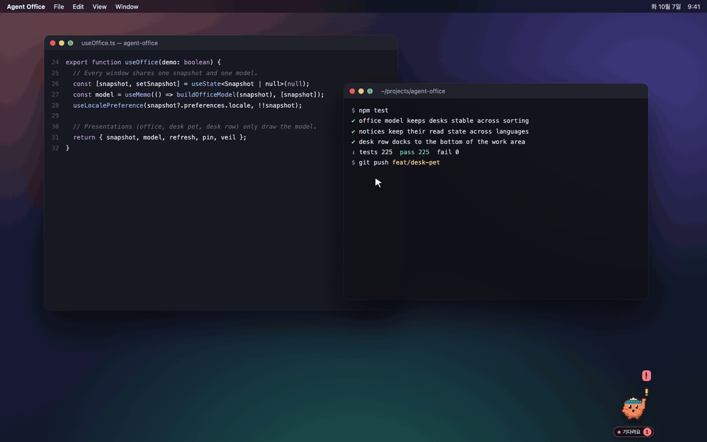

# Agent Office

### 내 AI 코딩 에이전트들이 바탕화면 위 작은 책상에서 일해요

Claude Code · Codex · OpenClaw의 **실제 로컬 세션**을 픽셀 동료로 보여줍니다.<br/>
화면 구석의 데스크 펫을 누르면 모든 동료의 책상이 화면 아래로 쫙 펼쳐져서,<br/>
누가 일하는지, 누가 나를 기다리는지, 방금 무엇이 끝났는지 에디터를 떠나지 않고 볼 수 있어요.

[](#-빠르게-시작하기)
[](https://www.electronjs.org/)
[](https://react.dev/)
[](https://www.typescriptlang.org/)
[](#-에이전트가-사무실-기억을-읽게-하기-mcp)
[](#-로컬-우선-설계)
[](#-라이선스)

[English](README.md) · **한국어**

</div>

---

## 🖥️ 바탕화면에 사는 팀

Agent Office는 계속 들여다봐야 하는 또 하나의 창이 아니에요. 바탕화면에 붙어 있다가, 나를 찾을 일이 생기면 알려줘요.

<table>
  <tr>
    <td width="24%" align="center" valign="middle">
      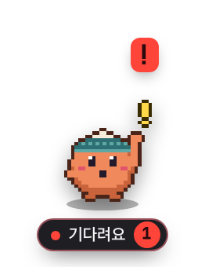<br/>
      <sub><b>데스크 펫</b><br/>구석에서 기다리다 소식이 온 동료로 바뀌어요</sub>
    </td>
    <td width="76%" valign="middle">
      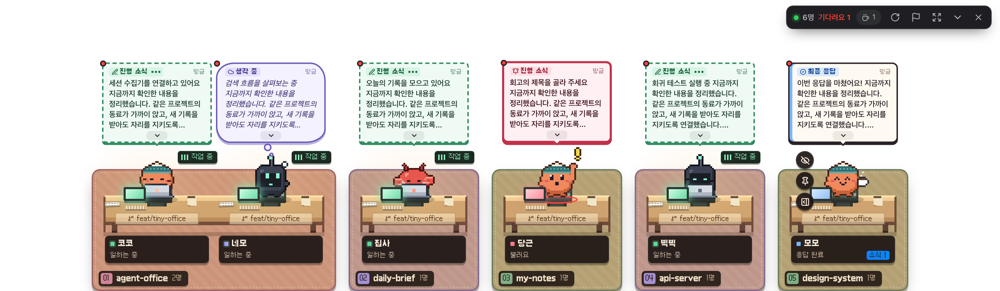<br/>
      <sub><b>한 줄 사무실</b> — 한 번 누르면 팀 전체가 실제 크기로 화면 아래에 쫙 펼쳐져요.</sub><br/><br/>
      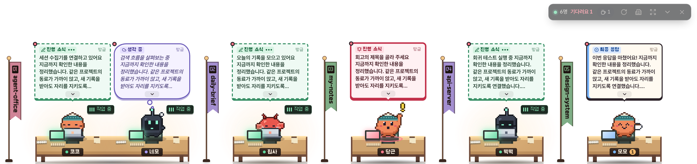<br/>
      <sub><b>바닥 책상</b> — 더 낮게: 화면 맨 아래에 책상만 세우고, 구역은 깃발로.</sub>
    </td>
  </tr>
</table>

- 🐾 **소식을 아는 펫** — 세션이 끝나거나 질문하면 펫이 그 동료로 바뀌어 이름표와 말풍선으로 알려주고, 부르는 동료가 있으면 **!** 를 띄워요. 원하는 곳으로 끌어다 놓으면 돼요.
- 🪑 **큰 사무실 그대로, 한 줄로** — 같은 프로젝트 구역, 브랜치를 함께 쓰는 긴 책상, 서브에이전트의 작은 보조 책상까지. 화면보다 팀이 커지면 양옆 화살표로 넘겨요.
- 💬 **바로 쓸 수 있는 말풍선** — 진행 상황이 사람이 읽는 문장으로 떠요. 그 자리에서 펼쳐 전문을 보고, 업무 카드를 팝업으로 열고, 말풍선에서 바로 답장도 해요(선택 기능).
- 🔥 **상태 표시등이 아니라 살아 있는 책상** — 새 요청이 오면 서류가 날아와 쌓이고, 오래 일할수록 *집중 중 → 몰입 중 → 불타는 중*으로 달아올라요.
- 🫥 **방해하지 않아요** — 투명한 곳의 클릭은 뒤의 에디터로 그대로 통과해요. 책상에 마우스를 올리면 고정하거나, 다음 대화까지 가릴 수 있어요.

## 왜 Agent Office인가요?

에이전트 셋이 워크트리 둘에 걸친 터미널 다섯 개에서 돌고 있을 때, 어려운 건 코드가 아니라 **지금 나를 기다리는 게 뭔지 아는 것**입니다. Agent Office는 도구들이 이미 남기고 있는 세션 기록을 읽어서 세션마다 책상을 하나씩 내어줍니다.

- 🙋 **나를 기다려요** — 질문하거나 입력을 기다리는 세션은 동료가 손을 들어요.
- 📬 **확인할 결과** — 최종 응답은 터미널에서 흘러가지 않고 소식함에 쌓여요.
- ⌨️ **일하는 중** — 진행 상황이 도구 이름 대신 사람이 읽는 문장으로 말풍선에 떠요.
- ☕ **대기 중 → 퇴근** — 응답을 마친 동료는 30분 동안 대기하다 쉬고, 4시간 조용하면 대기 라운지로 퇴근, 일주일 뒤 보관 공간으로 옮겨가요.

설치할 hook도, CLI를 감싸는 래퍼도, 클라우드도 없습니다. 원본은 **읽기 전용**으로만 열고, 세션에 답장하는 건 따로 켜는 기능이에요.

<div align="center">
  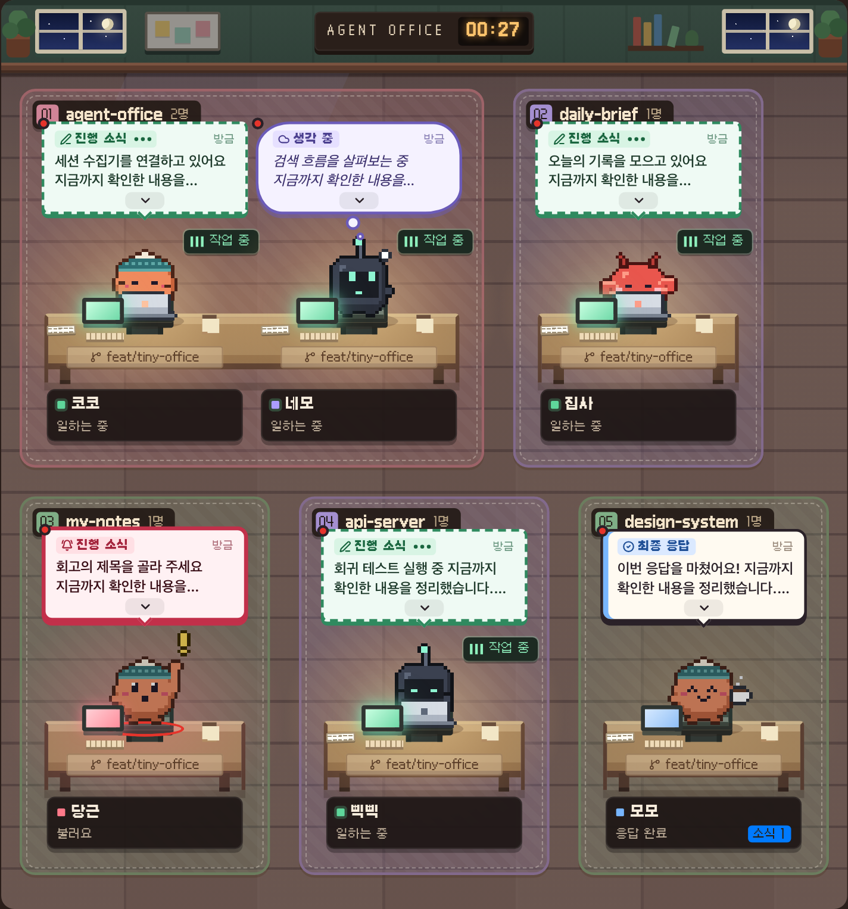<br/>
  <sub>프로젝트는 바닥 구역, 같은 브랜치·worktree는 긴 공동 책상, 서브에이전트는 부모 옆 낮은 책상에 앉아요.</sub>
</div>

## 🏢 큰 사무실

전체 그림이 필요할 땐 큰 사무실을 열어요. 프로젝트마다 바닥 구역이 있고, 명단은 나를 기다리는 순서로, 동료마다 업무 카드가 있어요.

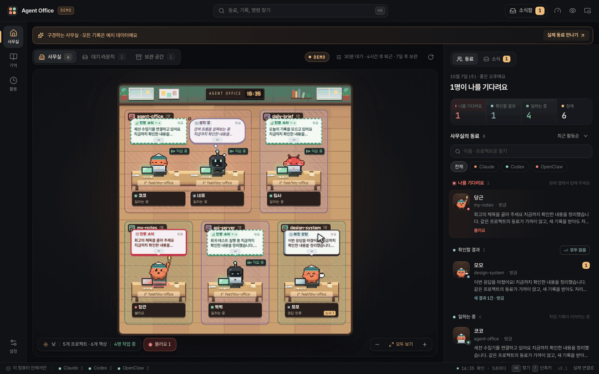

<table>
  <tr>
    <td width="50%" valign="top">
      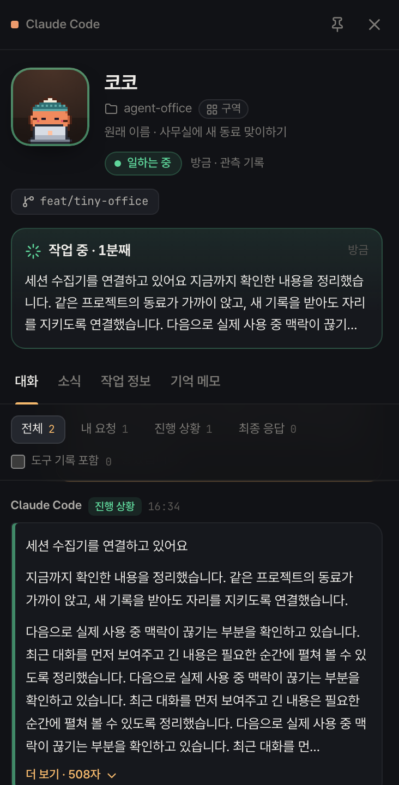<br/>
      <b>업무 카드</b><br/>
      동료를 누르면 사무실을 가리지 않는 오른쪽 패널이 열려요. 내 요청, 실시간 진행, 최종 응답, 필요할 때 펼치는 도구 기록, 브랜치·worktree, 토큰과 API 환산 비용, PR·이슈 카드, 내 메모까지.
    </td>
    <td width="50%" valign="top">
      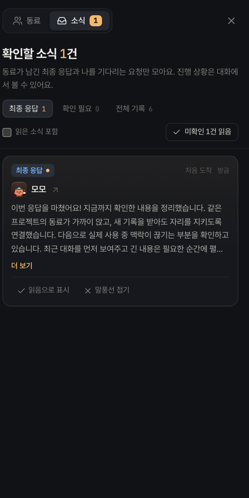<br/>
      <b>소식함</b><br/>
      최종 응답 중심. 질문은 <i>확인 필요</i>로 따로, 나머지는 전체 기록으로 분리해요. 읽음 상태는 재시작 후에도 남고, 말풍선은 기본 3시간 유지돼요.
    </td>
  </tr>
  <tr>
    <td width="50%" valign="top">
      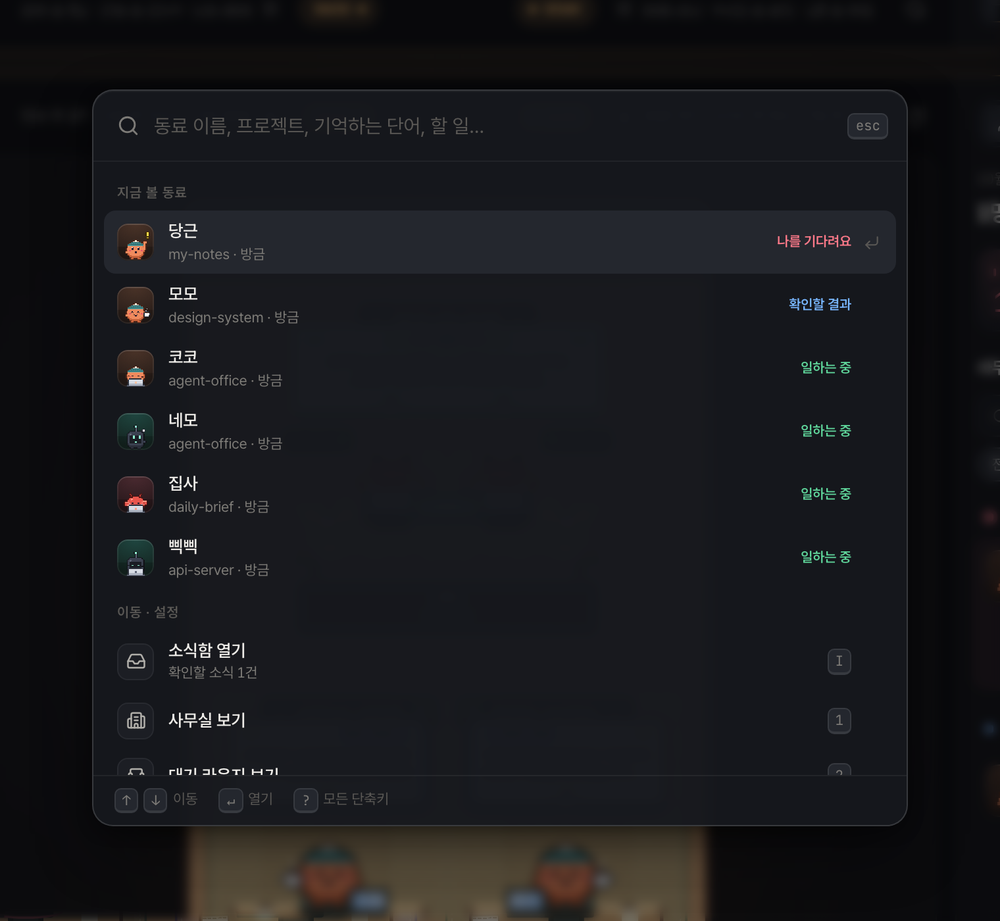<br/>
      <b>⌘K 명령 팔레트와 키보드 처리</b><br/>
      동료·기록·명령으로 바로 이동. <kbd>J</kbd>/<kbd>K</kbd> 이동, <kbd>R</kbd> 읽음, <kbd>I</kbd> 소식함, <kbd>?</kbd> 전체 단축키. 자리를 비웠다 돌아오면 그사이 온 소식을 요약해 줘요.
    </td>
    <td width="50%" valign="top">
      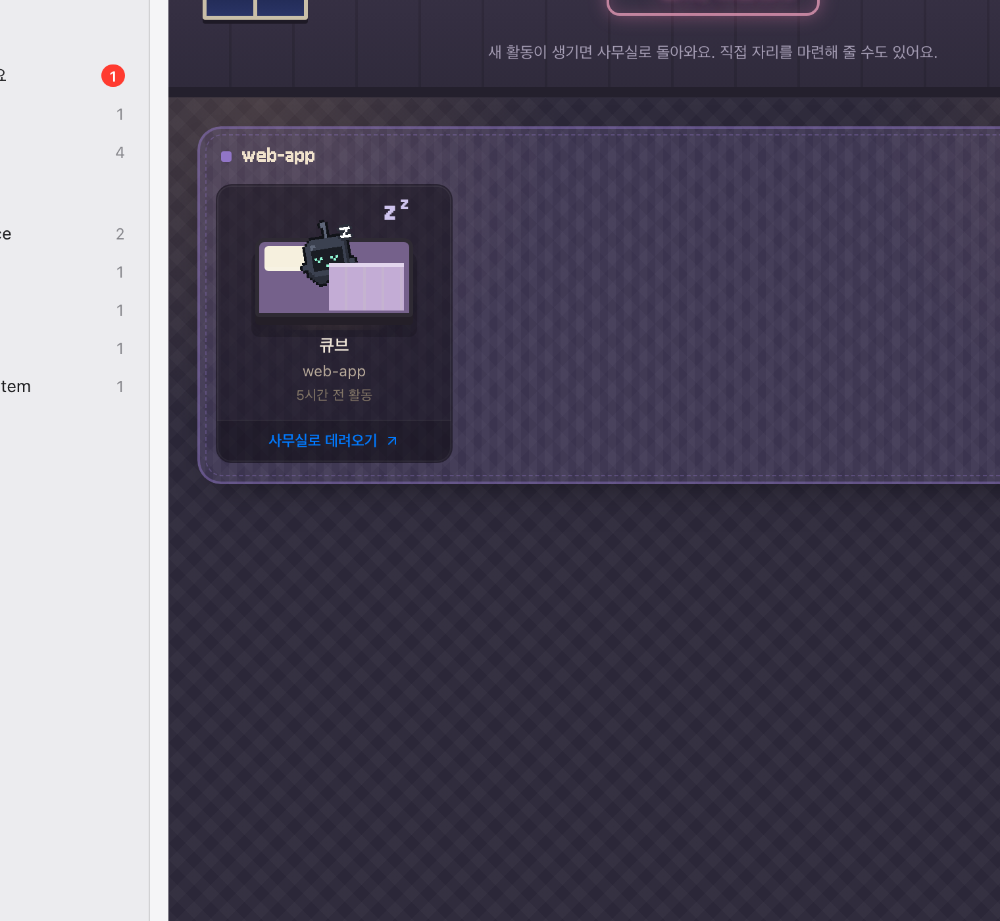<br/>
      <b>대기 라운지와 보관 공간</b><br/>
      새 활동이 없는 동료는 4시간 뒤 소파로 퇴근하고, 7일 뒤 보관 공간으로 옮겨가요. 둘 다 설정 가능하고, 고정하면 책상을 지켜요.
    </td>
  </tr>
</table>

### 💬 바로 이동하고 답장하기

- **Orca**나 **tmux**에서 돌고 있는 Claude Code 세션은 업무 카드에 *Orca로 이동 / tmux로 이동* 버튼이 생겨요.
- **터미널로 보내기**(데스크탑 전용, 기본 꺼짐, 켤 때 네이티브 확인)를 켜면 업무 카드나 말풍선의 답장 버튼으로 바로 이어서 말할 수 있어요. 쉬는 중인 Claude Code 세션은 그 터미널에 입력되고, 실행 중인 Codex CLI 세션은 `codex queue`로 전달돼요.
- 권한 승인은 절대 보내지 않고, 터미널 전면을 가진 쉬는 세션에만 입력하며, 전달을 확인하지 못하면 그렇게 알려줘요. 대상 확인 과정: [터미널 연결](docs/development/TERMINAL.md).

### 그 밖에

| | |
| --- | --- |
| 🧭 **실제 세션, 실제 이름** | 원본 세션 이름이 먼저, 프로젝트는 그 아래. 이어지는 대화는 합치고 실제 fork·서브에이전트는 관계를 유지해요. |
| 🗂️ **모노레포용 사용자 지정 구역** | 워크트리·폴더 하위·브랜치 패턴(`team/lab-*`)·세션 단위로 바닥을 나누거나, 동료를 다른 구역으로 끌어다 놓으면 돼요. |
| 🌿 **Git을 아는 책상** | 기록 당시 브랜치/커밋과 지금 checkout을 구분해서 보여줘요 (`main · 현재`, `HEAD · 커밋`). |
| 🫥 **동료 가리기** | 눈 버튼으로 다음 대화가 올 때까지 책상을 가려요. 확인 요청·오류는 바로 보여요. |
| 💭 **뜻이 보이는 말풍선** | 내 요청·생각 중·진행 메모·최종 응답·응답 필요·확인 필요가 서로 다른 모양이고, 그 자리에서 펼쳐 봐요. |
| 📌 **고정** | 오래 조용해도 사무실에 남겨요. |
| 🔎 **도구를 넘나드는 검색** | Claude Code · Codex · OpenClaw 기록을 키워드 하나로 검색. |
| 🤝 **인수인계 Markdown** | 메모·근거·연결된 결과를 묶어 미리보기·복사·저장. |
| 📊 **사용량과 비용** | Claude·Codex 구독 한도 조회, 세션별 토큰과 API 환산 비용. |
| 🔗 **PR·이슈 카드** | 세션의 GitHub 링크를 기존 `gh` 로그인으로 제목·상태까지 확인한 카드로. |
| 🙈 **프라이버시 제어** | 화면 공유용 내용 숨기기, 프로젝트 제외, 도구별 수집 중단, 움직임 줄이기. |
| 🌐 **English & 한국어** | 시스템 언어를 따르고(미지원 언어는 영어), 설정에서 언제든 바꿀 수 있어요. |

## 🚀 빠르게 시작하기

> **Apple Silicon macOS**와 **Node.js 24 이상**에서 개발·검증했습니다.

```bash
git clone https://github.com/kys42/agent-office.git
cd agent-office
npm ci
npm run build
npm start
```

macOS 앱으로 패키징:

```bash
npm run package
open "release/Agent Office-darwin-arm64/Agent Office.app"
```

> 로컬 실행용 패키지이며 서명·공증은 아직 적용하지 않았습니다.

둘러보기만 하려면 **합성 데모 데이터**로 브라우저 미리보기를 띄우세요. 내 컴퓨터의 기록은 읽지 않습니다.

```bash
npm run dev
# http://127.0.0.1:5173/?demo&lang=ko  한국어 데모 사무실
# http://127.0.0.1:5173/?demo          영어 데모 사무실
# http://127.0.0.1:5173                실제 세션
```

## 🧩 동작 방식

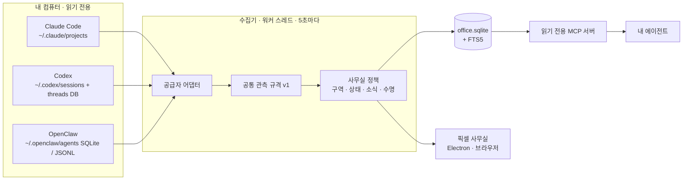

원본 형식은 어댑터에서 끝나고, 사무실은 하나의 공통 규격만 읽습니다. 공급자별 데이터 근거, 그룹·관계, 실행 상태, 소식 수명, 아직 지원하지 않는 범위는 [문서](#-문서)에 따로 정리했습니다.

- **Electron main → 샌드박스 preload IPC → 워커 스레드.** 렌더러는 파일·프로세스·Node API에 직접 접근하지 않아요.
- **추측하지 않고 관측합니다.** 상태는 기록에 남은 근거로만 판단해요. 응답 완료를 업무 완료로 단정하지 않고, 조용한 세션을 종료됐다고 확정하지 않아요.
- **범위를 정해 읽습니다.** 기본 도구별 최근 120개(설정에서 60~300개). 큰 파일은 처음·끝 구간과 최근 180개 이벤트를 보존하고 부분 기록임을 표시해요.

## 🔒 로컬 우선 설계

- 앱 저장소는 `~/Library/Application Support/Agent Office/office.sqlite`(디렉터리 `0700`, DB `0600`). 원본 세션은 **절대 수정하지 않아요.**
- 인증 정보를 앱 DB나 화면에 복제하지 않아요. **사용량** 버튼의 Claude 조회는 기존 OAuth credential을 메모리에서만 읽어 Anthropic의 고정 사용량 API로 보내고, Codex는 설치된 CLI의 읽기 전용 한도 RPC를 써요.
- PR·이슈 조회는 기존 `gh` 로그인으로 GitHub에 읽기 요청만 보내며, 데모와 화면 내용 숨기기에서는 생략해요.
- **터미널로 보내기**는 기본 꺼짐이고, 공유 설정이 아니라 데스크탑 프로필에 저장되며, 웹 미리보기에서는 쓸 수 없어요.
- 프로젝트 제외는 사무실·검색·인수인계·MCP에 함께 적용되는 조회 정책이에요. 삭제 기능은 아니에요.
- *화면 내용 숨기기*는 화면의 내용을 가리는 기능이에요. OS 캡처 차단이나 암호화가 아니에요.

| 환경 변수 | 기본값 | 용도 |
| --- | --- | --- |
| `CLAUDE_CONFIG_DIR` | `~/.claude` | Claude Code 세션 (`/projects`) |
| `CODEX_HOME` | `~/.codex` | Codex 세션 (`/sessions`)과 threads DB |
| `OPENCLAW_STATE_DIR` | `~/.openclaw` | OpenClaw 에이전트 (`/agents`) |
| `AGENT_OFFICE_DATA_DIR` | `~/Library/Application Support/Agent Office` | 앱 데이터베이스 |
| `AGENT_OFFICE_LOCALE` | 시스템 언어 | 수집기 언어 강제 지정 (`en` / `ko`) |

## 🤖 에이전트가 사무실 기억을 읽게 하기 (MCP)

같은 DB를 **읽기 전용**으로 여는 MCP 서버가 함께 들어 있어, 한 에이전트가 다른 에이전트의 작업을 찾아볼 수 있어요. 앱을 한 번 실행해 기록을 수집하고 빌드한 뒤, 사용할 도구의 MCP 설정에 추가하세요.

```json
{
  "mcpServers": {
    "agent-office": {
      "command": "/absolute/path/to/node",
      "args": ["/absolute/path/to/agent-office/dist-desktop/mcp.cjs"]
    }
  }
}
```

| 도구 | 하는 일 |
| --- | --- |
| `office_list_sessions` | 저장된 세션 목록 (실행 중임을 보장하지 않음) |
| `office_search` | 허용된 세션 기록 키워드 검색 |
| `office_get_session` | 세션 상세와 근거, 부분 수집 여부 |
| `office_prepare_handoff` | 같은 스냅샷의 인수인계 Markdown |

Node 24 이상. 데이터 위치를 바꿨다면 MCP 서버에도 `AGENT_OFFICE_DATA_DIR`을 같은 값으로 지정하세요. 자동 등록이나 기존 설정 덮어쓰기는 하지 않아요. 검색된 원문은 참고 자료일 뿐 실행 지시가 아니에요. Codex TOML 예시는 [연결 가이드](docs/development/MCP.md)에 있어요.

## 📡 Tailscale 미리보기

빌드 후 `npm run preview`로 [로컬 미리보기](http://127.0.0.1:4319/)를 띄웁니다(`?demo`는 예시 사무실). Tailscale로 내 기기에서 보려면:

```bash
AGENT_OFFICE_WEB_ORIGIN=https://your-device.your-tailnet.ts.net:4319 npm run preview
tailscale serve --bg --https=4319 http://127.0.0.1:4319
# 중지: tailscale serve --https=4319 off
```

실제 세션 내용을 제공하므로 접근 범위는 tailnet ACL로 관리하세요.

## 🌐 언어

기본·대체 언어는 영어이고 한국어를 완전히 지원해요. 기본 설정인 **시스템 언어**는 OS 언어를 따르며, **설정 → 언어**에서 언제든 바꿀 수 있어요. 미리보기 URL에 `?lang=ko` / `?lang=en`을 붙이면 언어를 고정해요.

모든 문구는 [`src/shared/i18n/locales`](src/shared/i18n/locales)의 타입 있는 카탈로그에 있어요. 영어가 기준이고, 다른 언어는 키가 정확히 같아야 타입체크를 통과해요. 새 언어는 폴더 하나와 [`src/shared/i18n/index.ts`](src/shared/i18n/index.ts) 한 줄이면 추가돼요.

## 🧪 개발과 검증

```bash
npm test                         # 파서·상태·사용량·정책·저장·다국어
npm run typecheck
npm run test:ui                  # Playwright (필요하면 npm run dev 자동 실행)
npm run test:desktop             # build 후 Electron/IPC/데스크 펫·책상 줄 창, 합성 fixture
npm run test:mcp                 # build 후 MCP stdio 계약
node scripts/screenshots.mjs     # 데모 데이터로 README 캡처 재생성, 영/한 (npm run dev 필요)
node scripts/readme-hero.mjs ko  # 큰 사무실 투어 GIF (npm run dev + ffmpeg 필요)
node scripts/readme-desktop.mjs ko  # 바탕화면 장면 PNG·GIF (npm run dev + ffmpeg 필요)
```

테스트는 합성 데이터만 쓰고 원본을 수정하지 않아요. 실제 연결 UI smoke만 로컬 기록을 읽어요.

## 🗺️ 로드맵

아직 만들지 않았고, 화면에서 된 것처럼 꾸미지도 않는 것들: 권한 승인 전달·Orca/tmux 밖 터미널의 세션 제어, 모델 기반 요약·의미 검색, 회고 예약, 동료 성장, 원격 동기화, 서명·공증·자동 업데이트.

## 📄 라이선스

Agent Office는 [PolyForm Noncommercial License 1.0.0](LICENSE.md)에 따라 **비상업적 이용에 한해** 소스를 공개합니다. 개인 프로젝트·학습·연구·취미, 비영리 기관의 사용은 자유롭게 할 수 있지만 **상업적 이용은 허용하지 않습니다.**

앱에 포함된 서드파티 코드·폰트·에셋은 각자의 라이선스를 따릅니다 — [서드파티 고지](THIRD_PARTY_NOTICES.md).

## 📚 문서

[문서 지도](docs/README.md) · [프로젝트 맥락과 결정](docs/golden/PROJECT-CONTEXT.md) · [골든 사무실 정책](docs/golden/GOLDEN-OFFICE-POLICY.md) · [상태 정책서](docs/golden/STATUS-POLICY.md) · [기능 정책서](docs/golden/FEATURE-POLICY.md) · [공통 관측 규격 v1](docs/golden/OFFICE-OBSERVATION-PROTOCOL.md) · [세션 분석·모듈 출처](docs/development/SESSION-INGESTION.md) · [아키텍처](docs/development/ARCHITECTURE.md) · [터미널 연결](docs/development/TERMINAL.md) · [사용량과 실행 위치](docs/development/USAGE-AND-WORKSPACE.md) · [검증 기록](docs/development/QA.md) · [고지](THIRD_PARTY_NOTICES.md)

<div align="center">
<br/>
<sub>모니터보다 에이전트가 많은 모두를 위해 🧡</sub>
</div>
