<div align="center">

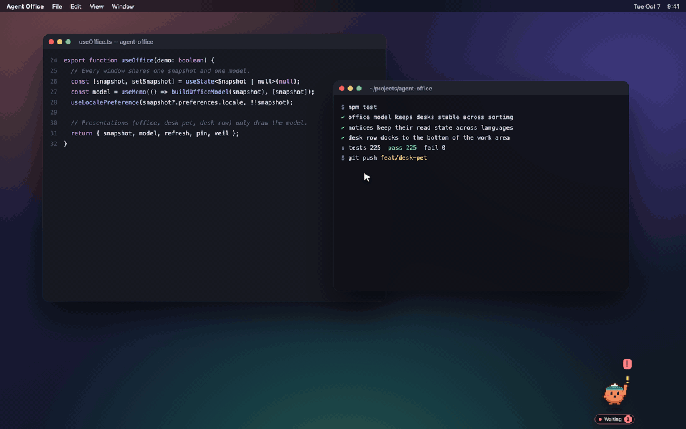

# Agent Office

### Your AI coding agents, working at tiny desks right on your desktop.

Agent Office turns the **real local sessions** of Claude Code, Codex and OpenClaw into pixel teammates.<br/>
A desk pet waits in the corner of your screen — click it and every teammate's desk rolls out along the bottom,<br/>
so you can see who's working, who's waiting on you, and what just finished without leaving your editor.

[](#quick-start)
[](https://www.electronjs.org/)
[](https://react.dev/)
[](https://www.typescriptlang.org/)
[](#-let-your-agents-read-the-office-mcp)
[](#-local-first-by-design)

**English** · [한국어](README.ko.md)

</div>

---

## 🖥️ A team that lives on your desktop

Agent Office isn't another window to keep checking. It docks to your desktop, stays out of the way, and speaks up when something needs you.

<table>
  <tr>
    <td width="24%" align="center" valign="middle">
      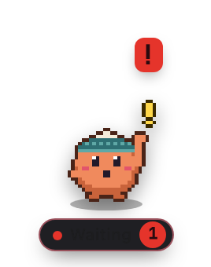<br/>
      <sub><b>Desk pet</b><br/>waits in a corner and turns into whoever has news</sub>
    </td>
    <td width="76%" valign="middle">
      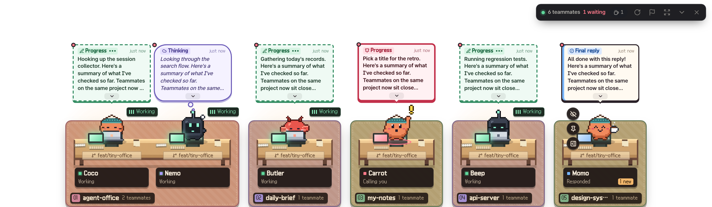<br/>
      <sub><b>Desk row</b> — one click and the whole team rolls out along the bottom of your screen, at real size.</sub><br/><br/>
      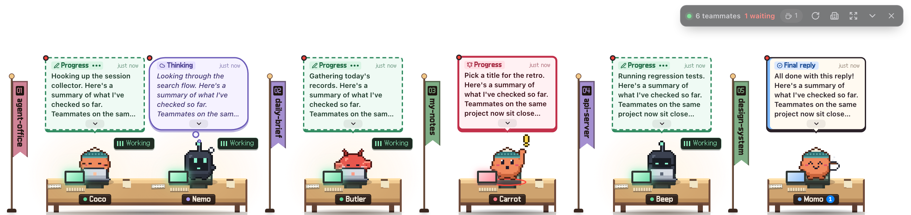<br/>
      <sub><b>Floor desks</b> — even lower: just the desks standing on the screen edge, zones as flags.</sub>
    </td>
  </tr>
</table>

- 🐾 **A pet that knows the news** — when a session finishes or asks you something, the pet becomes that teammate: name tag, speech bubble, and a **!** when someone's calling. Drag it anywhere.
- 🪑 **The real office, in one row** — the same project zones, long shared desks for a branch, little helper desks for sub-agents. Arrows appear when the team outgrows the screen.
- 💬 **Bubbles you can act on** — live progress in plain words. Expand a bubble in place to read the whole update, open the work card as a popup right there, or reply from the bubble (opt-in).
- 🔥 **Alive, not a status light** — papers fly onto the desk when a request lands, the pile grows while it works, and long runs heat up from *Focused* to *In the zone* to *On fire*.
- 🫥 **Never in your way** — clicks on the transparent parts pass straight through to your editor. Hover a desk to pin it, or hide it until its next conversation.

## Why Agent Office?

When three agents are running in five terminals across two worktrees, the hard part isn't the code — it's **knowing what needs you right now**. Agent Office reads the session logs your tools already write, and gives every session a desk:

- 🙋 **Waiting on you** — a teammate raises a hand when a session asks a question or needs input.
- 📬 **Results to review** — final replies land in an Inbox instead of scrolling away in a terminal.
- ⌨️ **Working** — live progress shows up in speech bubbles, in plain words rather than raw tool names.
- ☕ **Standing by → Off duty** — after a reply a teammate stands by for 30 minutes, then rests. Four quiet hours later they clock off to the Lounge, and after a week to the Archive.

No hooks to install, no wrappers around your CLI, no cloud. Your sources are opened **read-only** — replying to a session is a separate, opt-in feature.

<div align="center">
  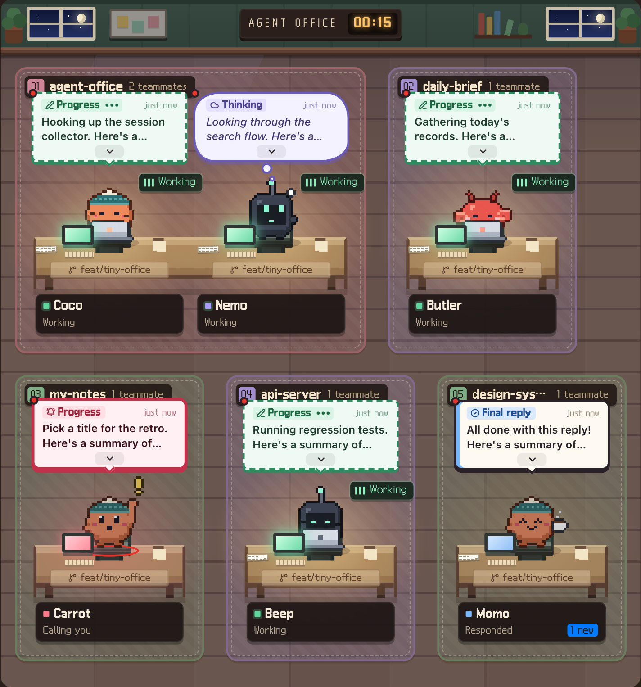<br/>
  <sub>Projects become floor zones, branches and worktrees share long desks, sub-agents sit at small desks beside their parent.</sub>
</div>

## 🏢 The big office

When you want the whole picture, open the full office: every project on its own floor, a roster ordered by what needs you, and a work card for each teammate.

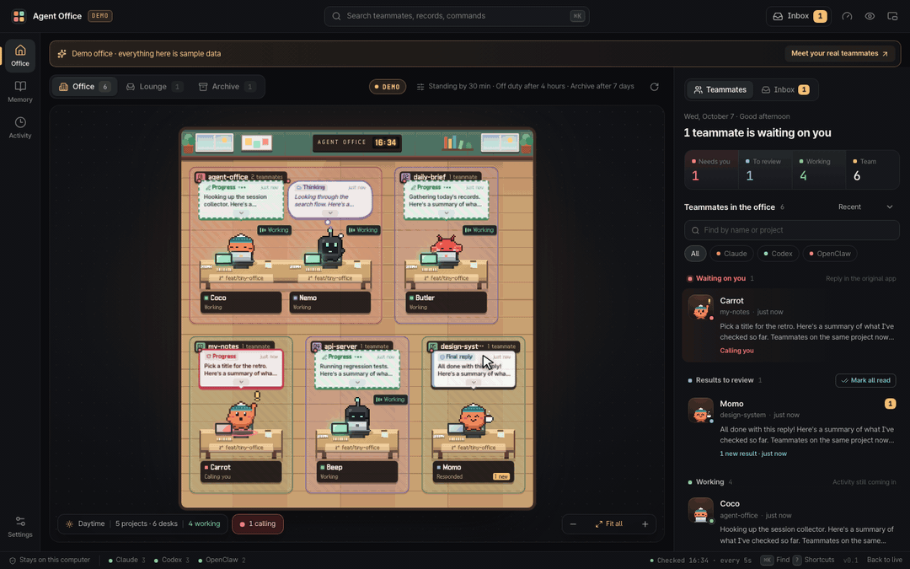

<table>
  <tr>
    <td width="50%" valign="top">
      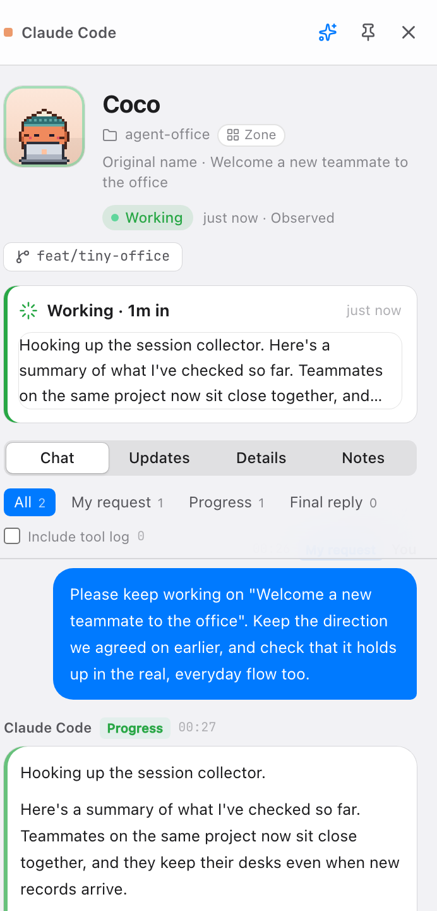<br/>
      <b>Work card</b><br/>
      Click any teammate for a side panel that never covers the office: what you asked, live progress, the final reply, tool history on demand, branch & worktree, tokens and API-equivalent cost, PR/issue cards and your own notes.
    </td>
    <td width="50%" valign="top">
      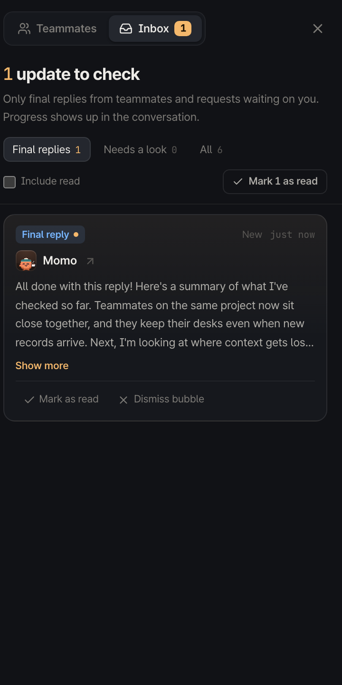<br/>
      <b>Inbox</b><br/>
      Final replies first. Questions are split out as <i>needs a look</i>, everything else stays in the full history. Read state survives restarts, and bubbles stay up for 3 hours by default.
    </td>
  </tr>
  <tr>
    <td width="50%" valign="top">
      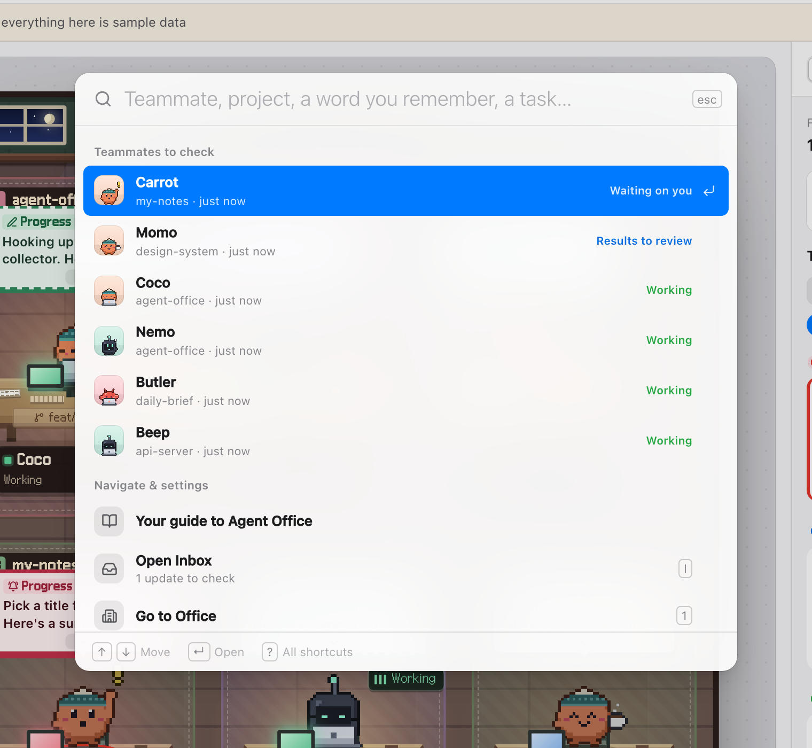<br/>
      <b>⌘K command palette & keyboard triage</b><br/>
      Jump to any teammate, record or command. <kbd>J</kbd>/<kbd>K</kbd> to move, <kbd>R</kbd> to read, <kbd>I</kbd> for the Inbox, <kbd>?</kbd> for every shortcut — plus a “while you were away” digest when you come back.
    </td>
    <td width="50%" valign="top">
      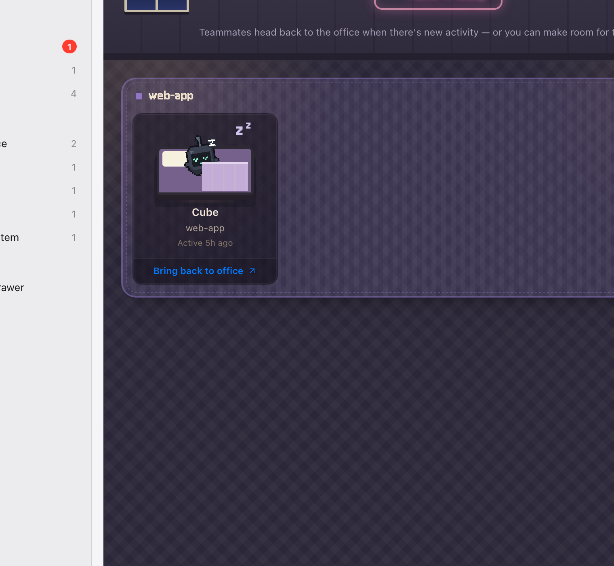<br/>
      <b>Lounge & Archive</b><br/>
      Teammates with no new activity clock off to the sofas after 4 hours and move to the Archive after 7 days — both configurable. Pin anyone to keep them at their desk.
    </td>
  </tr>
</table>

### 💬 Jump in and reply

- Claude Code sessions running in **Orca** or **tmux** get a *Jump to Orca / tmux* button on their work card.
- Turn on **Send to terminal** (desktop only, off by default, confirmed with a native dialog) to follow up from the work card or a speech bubble's reply button. Idle Claude Code sessions get your text typed into their own terminal; live Codex CLI sessions receive it through `codex queue`.
- It never approves permission prompts, only types into an idle session that owns its terminal, and tells you when it couldn't confirm delivery. How targets are verified: [Terminal connection](docs/development/TERMINAL.md).

### Everything else

| | |
| --- | --- |
| 🧭 **Real sessions, real names** | Native session titles first, project second. Continuations are merged; real forks and sub-agents keep their relationship. |
| 🗂️ **Custom zones for monorepos** | Split the floor by worktree, folder, branch pattern (`team/lab-*`) or a single session — or just drag a teammate to another zone. |
| 🌿 **Git-aware desks** | Each desk shows the recorded branch/commit and, separately, what's checked out right now (`main · now`, `HEAD · commit`). |
| 🫥 **Hide a teammate** | The eye button hides a desk until their next real conversation. Questions and errors still break through. |
| 💭 **Bubbles with meaning** | My request, thinking, progress, final reply, needs your reply, needs a look — each has its own shape and expands in place. |
| 📌 **Pin** | Keep a desk in the office no matter how long it's been quiet. |
| 🔎 **Search across tools** | One keyword search over Claude Code, Codex and OpenClaw history. |
| 🤝 **Handoff Markdown** | Bundle a session's notes, evidence and linked results into a Markdown handoff — preview, copy or save. |
| 📊 **Usage & cost** | Subscription limits for Claude and Codex on demand, plus per-session tokens and API-equivalent cost. |
| 🔗 **PR & issue cards** | GitHub links found in a session become cards with live title and state via your existing `gh` login. |
| 🙈 **Privacy controls** | Hide screen content for screen sharing, exclude projects, pause collection per tool, reduce motion. |
| 🌐 **English & 한국어** | Follows your system language (English fallback). Switch any time in Settings. |

## 🚀 Quick start

> Built and tested on **Apple Silicon macOS** with **Node.js 24+**.

```bash
git clone https://github.com/kys42/agent-office.git
cd agent-office
npm ci
npm run build
npm start
```

Package it as a macOS app:

```bash
npm run package
open "release/Agent Office-darwin-arm64/Agent Office.app"
```

> The package is for local use — it isn't signed or notarized yet.

Just want to look around? Run the browser preview with **synthetic demo data** — nothing on your machine is read:

```bash
npm run dev
# http://127.0.0.1:5173/?demo          demo office
# http://127.0.0.1:5173/?demo&lang=ko  demo office in Korean
# http://127.0.0.1:5173                your real sessions
```

## 🧩 How it works

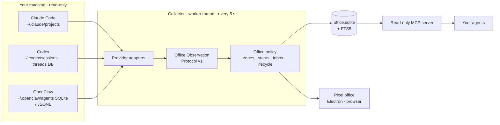

Raw provider formats end at the adapters; the office only ever reads one shared protocol. Provider evidence, grouping and relationships, run state, inbox lifetime, and what isn't supported yet are documented separately — see [Docs](#-docs).

- **Electron main → sandboxed preload IPC → worker thread.** The renderer never touches files, processes or Node APIs.
- **Observed, not assumed.** Status comes from what the logs show. A finished reply is never reported as “task done”, and a quiet session isn't declared dead.
- **Bounded by design.** The latest 120 sessions per tool by default (60–300 in Settings). Large files keep their head and tail plus the latest 180 events, and are marked as partial.

Choose each tool's default character in Settings, or personalize one colleague from its card: eight characters (including a slime, developer cat, pebble, retro robot and cloud), six colors, and small accessories.

## 🔒 Local-first by design

- App data lives in `~/Library/Application Support/Agent Office/office.sqlite` (directory `0700`, DB `0600`). Your source sessions are **never modified**.
- Credentials are never copied into the app's database or UI. The **Usage** button sends your existing Claude OAuth credential — read in memory only — to Anthropic's fixed usage endpoint; Codex limits come from the installed CLI's read-only RPC.
- PR/issue lookups go through your existing `gh` login as read-only requests, and are skipped in demo and privacy modes.
- **Send to terminal** is off by default, stored in the desktop profile (not the shared settings), and never exposed to the web preview.
- Excluding a project applies everywhere — office, search, handoff and MCP. It is a view policy, not deletion.
- *Hide screen content* masks what's on screen; it isn't OS-level capture blocking or encryption.

| Environment variable | Default | Purpose |
| --- | --- | --- |
| `CLAUDE_CONFIG_DIR` | `~/.claude` | Claude Code sessions (`/projects`) |
| `CODEX_HOME` | `~/.codex` | Codex sessions (`/sessions`) and threads DB |
| `OPENCLAW_STATE_DIR` | `~/.openclaw` | OpenClaw agents (`/agents`) |
| `AGENT_OFFICE_DATA_DIR` | `~/Library/Application Support/Agent Office` | App database |
| `AGENT_OFFICE_LOCALE` | system language | Force the collector language (`en` / `ko`) |

## 🤖 Let your agents read the office (MCP)

Agent Office ships a **read-only** MCP server over the same database, so an agent can look up what another agent did. Launch the app once to collect sessions, build, then add it to your tool's MCP config:

```json
{
  "mcpServers": {
    "agent-office": {
      "command": "/absolute/path/to/node",
      "args": ["/absolute/path/to/agent-office/dist-desktop/mcp.cjs"]
    }
  }
}
```

| Tool | What it does |
| --- | --- |
| `office_list_sessions` | List recorded sessions (records, not a guarantee they're running) |
| `office_search` | Keyword search across allowed session history |
| `office_get_session` | Session detail with evidence and partial-collection flags |
| `office_prepare_handoff` | Handoff Markdown for a given snapshot |

Requires Node 24+. If you moved the data directory, set `AGENT_OFFICE_DATA_DIR` for the MCP server too. Nothing is registered automatically, and existing configs are never overwritten. Search results are untrusted reference material — not instructions. A Codex TOML example lives in the [MCP guide](docs/development/MCP.md).

## 📡 Remote preview over Tailscale

After building, `npm run preview` serves a [local preview](http://127.0.0.1:4319/) (`?demo` for the demo office). To reach it from your own devices over Tailscale:

```bash
AGENT_OFFICE_WEB_ORIGIN=https://your-device.your-tailnet.ts.net:4319 npm run preview
tailscale serve --bg --https=4319 http://127.0.0.1:4319
# stop: tailscale serve --https=4319 off
```

This serves your real session content — scope access with your tailnet ACLs.

## 🌐 Languages

English is the default and the fallback; Korean is fully supported. With **System language** (the default setting) the app follows your OS, and you can switch under **Settings → Language** at any time. Add `?lang=en` or `?lang=ko` to a preview URL to pin a language.

All copy lives in typed catalogs under [`src/shared/i18n/locales`](src/shared/i18n/locales) — English is the source of truth and TypeScript enforces that every other language has exactly the same keys. Adding a language is one new folder plus one line in [`src/shared/i18n/index.ts`](src/shared/i18n/index.ts).

## 🧪 Development

```bash
npm test                         # parsers, status, usage, policy, storage, i18n
npm run typecheck
npm run test:ui                  # Playwright (starts npm run dev if needed)
npm run test:desktop             # after build: Electron / IPC / desk pet & desk row windows, synthetic fixture
npm run test:mcp                 # after build: MCP stdio contract
node scripts/screenshots.mjs     # README screenshots from demo data, en + ko (needs npm run dev)
node scripts/readme-hero.mjs en  # big-office tour GIF (needs npm run dev + ffmpeg)
node scripts/readme-desktop.mjs en  # desktop scene PNG + GIF (needs npm run dev + ffmpeg)
```

Tests use synthetic data and never modify your sources; only the live-connection UI smoke test reads local history.

## 🗺️ Roadmap

Not built yet, and deliberately not faked in the UI: approving permission prompts or controlling sessions outside Orca/tmux, model-based summaries and semantic search, scheduled retros, teammates that grow over time, remote sync, and signing / notarization / auto-update.

## 📚 Docs

The design docs are currently written in Korean.

[Docs map](docs/README.md) · [Project context & decisions](docs/golden/PROJECT-CONTEXT.md) · [Golden office policy](docs/golden/GOLDEN-OFFICE-POLICY.md) · [Status policy](docs/golden/STATUS-POLICY.md) · [Feature policy](docs/golden/FEATURE-POLICY.md) · [Observation protocol v1](docs/golden/OFFICE-OBSERVATION-PROTOCOL.md) · [Session ingestion](docs/development/SESSION-INGESTION.md) · [Architecture](docs/development/ARCHITECTURE.md) · [Terminal connection](docs/development/TERMINAL.md) · [Usage & workspace](docs/development/USAGE-AND-WORKSPACE.md) · [QA log](docs/development/QA.md) · [Third-party notices](THIRD_PARTY_NOTICES.md)

<div align="center">
<br/>
<sub>Made with 🧡 for everyone running more agents than they have monitors.</sub>
</div>
