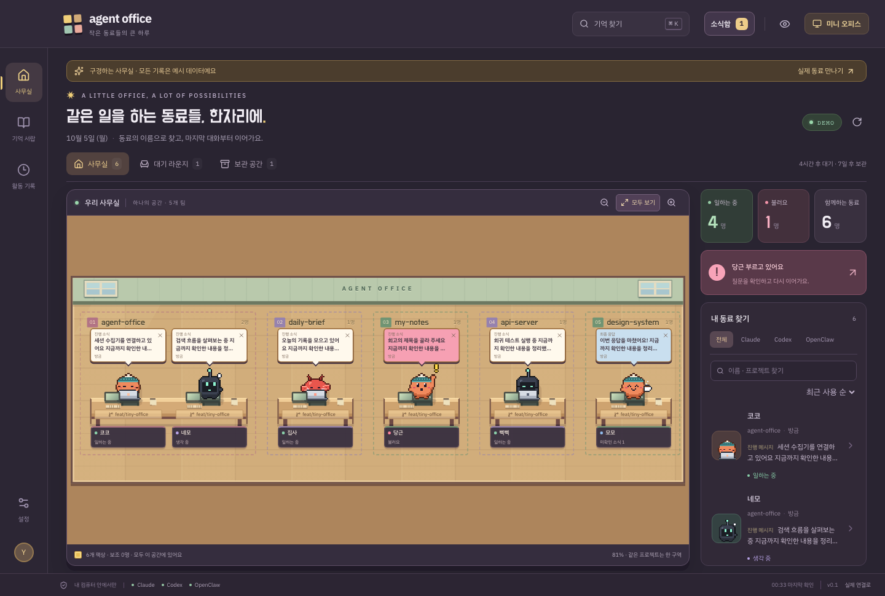

# Agent Office

**작은 사무실, 이어지는 업무 기억.**

Claude Code · Codex · OpenClaw의 실제 로컬 세션을 픽셀 동료로 만나는 macOS 데스크탑 앱. 시안 E의 사무실·캐릭터 에셋을 그대로 살리고, 기록을 읽고 검색하고 다음 작업에 건네는 경험을 연결했습니다.



## 실행

Apple Silicon macOS와 Node.js 24 이상을 기준으로 개발했습니다.

```bash
npm ci
npm run build
npm start
```

macOS 앱 만들기:

```bash
npm run package
open "release/Agent Office-darwin-arm64/Agent Office.app"
```

패키지는 로컬 실행용이며 배포용 서명·공증은 아직 적용하지 않았습니다. 이 컴퓨터에서 원본 로그를 읽습니다. PR·이슈 제목과 상태는 설치된 GitHub CLI의 기존 연결로 확인하며, 연결이 없어도 기록과 링크를 볼 수 있습니다.

브라우저 개발 미리보기:

```bash
npm run dev
# http://127.0.0.1:5173 — 실제 기록
# http://127.0.0.1:5173/?demo — 명시적으로 분리된 예시 데이터
```

## 여기서 할 수 있는 일

- 3종 에이전트의 실제 JSONL / SQLite 기록을 5초마다 확인
- 프로젝트별 실제 가구 자동 배치. 모든 주/보조 동료를 한 화면에 맞추고 확대·전체 보기 지원. 상태·검색·정렬로 자리를 섞지 않음
- 같은 프로젝트는 바닥 구역, 같은 브랜치·worktree는 긴 공동 책상, 모든 실제 서브에이전트는 부모 옆 낮은 책상
- 모노레포용 사용자 지정 구역: 워크트리·폴더 하위·브랜치 패턴(`kys42/lab-*`)·세션 단위 규칙으로 직접 나눈 구역이나 기존 구역에 앉힘. 캐릭터를 다른 구역/빈 바닥으로 끌어 놓아도 됨. 새로 오는 동료도 자동 적용, 설정에서 이름 바꾸기·삭제
- 책상에 기록 브랜치/커밋 표시. 현재 checkout을 별도 관측해 `main · 현재`, `HEAD · 커밋`을 구분
- 4시간 후 대기 라운지, 7일 후 보관 공간으로 이동. 설정 변경·고정·사무실 복귀 지원
- 실제 세션 이름을 먼저, 프로젝트를 그 아래 표시. 최근 활동 / 자주 찾은 순으로 탐색
- 명단은 할 일 순서: 나를 기다려요 → 확인할 결과 → 일하는 중 → 쉬는 중. 행에 올리면 해당 책상 스포트라이트
- 업무 카드 상단 ‘지금’ 카드: 호출이면 원래 앱 재개, 새 결과면 그 자리에서 읽기, 작업 중이면 경과 시간
- Orca·tmux에서 실행 중인 Claude Code 세션은 업무 카드에서 그 터미널 탭/패널로 바로 이동. 설정의 ‘터미널로 보내기’를 켜면 쉬는 중인 Claude 세션의 터미널, 실행 중인 Codex CLI 세션(`codex queue`)에 카드나 사무실 말풍선의 답장 버튼으로 바로 이어서 말하기(데스크탑 전용, 기본 꺼짐)
- ⌘K 명령 팔레트(동료·기록·명령), J/K/R/I 키보드 처리와 `?` 단축키 도움말, 자리 비운 사이 요약
- 세션 클릭 → 오른쪽 상세 패널. 대화는 내 요청/진행 상황/최종 응답별 선택, 더 보기, 선택해서 포함하는 도구 기록
- 소식함은 최종 응답 중심. 질문은 확인 필요, 나머지는 전체 기록으로 분리하고 분류별 일괄 읽음 지원
- 기본 3시간 말풍선과 미확인 소식함. 읽음·말풍선 접기를 분리해 재시작 후에도 저장
- 플랫폼 공통 실행 관측과 장식 행동 분리, 새 요청 봉투 효과·자리 옆 휴식
- PR·이슈의 실제 링크 카드와 GitHub에서 확인한 제목·상태
- 별명, 고정, 업무 메모, 결과 확인, 기록 보관
- 도구를 넘나드는 키워드 검색과 인수인계 Markdown 미리보기·복사·저장
- 투명한 미니 오피스와 트레이에서 큰 사무실로 복귀
- 프로젝트 제외, 도구별 수집 중단, 움직임 줄이기, 화면 내용 숨기기
- 읽기 전용 MCP로 같은 기억에 접근

기본 최근 120개/도구를 불러옵니다. 연결 설정에서 60~300개로 바꿀 수 있습니다. 큰 파일의 처음·최근 구간, 최근 180개 이벤트를 보존하고 부분 기록임을 표시합니다. 사용량 미지원은 `—`, 오래된 기록은 대기·보관 공간에서 확인합니다. ‘자주 찾은 순’은 이 앱에서 세션을 열어 본 횟수입니다. 응답 완료는 업무 완료로 단정하지 않습니다.

## 제품과 구현 정본

[전체 문서 지도](docs/README.md) · [프로젝트 맥락과 결정](docs/golden/PROJECT-CONTEXT.md) · [골든 사무실 정책](docs/golden/GOLDEN-OFFICE-POLICY.md) · [세션 분석·모듈 출처](docs/development/SESSION-INGESTION.md) · [공통 관측 규격 v1](docs/golden/OFFICE-OBSERVATION-PROTOCOL.md)

원본 어댑터 → 공통 관측 → 제품 정책 → 사무실 표현을 분리합니다. 공급자별 데이터 근거, 그룹/관계, 실행 상태, 소식 수명, 후보 기능과 아직 지원하지 않는 범위를 함께 기록합니다.

## 로컬 데이터와 연결 경로

앱 저장소: `~/Library/Application Support/Agent Office/office.sqlite`. 원본 세션은 수정하지 않습니다. 인증 설정을 앱 DB나 화면에 복제하지 않습니다. 사용량 버튼의 Claude 조회는 기존 OAuth credential을 메모리에서 읽어 Anthropic의 고정 사용량 API에만 전송하며, Codex는 설치된 CLI의 읽기 전용 한도 RPC를 사용합니다. PR·이슈 조회는 기존 gh 인증을 통해 GitHub에 읽기 요청을 보냅니다.

환경 변수: `CLAUDE_CONFIG_DIR`, `CODEX_HOME`, `OPENCLAW_STATE_DIR`, `AGENT_OFFICE_DATA_DIR`. 기본 소스는 `~/.claude/projects`, `~/.codex/sessions`, `~/.openclaw/agents`입니다. Codex threads DB와 OpenClaw agent DB는 readOnly로 엽니다.

프로젝트 제외는 앱·검색·인수인계·MCP 조회에 함께 적용됩니다. 원본이나 기존 저장 데이터 삭제 기능은 아닙니다. 화면 내용 숨기기는 OS 캡처 차단이나 암호화를 의미하지 않습니다.

## Tailscale 미리보기

빌드 후 `npm run preview`로 [로컬 미리보기](http://127.0.0.1:4319/)를 실행합니다. `?demo`를 붙이면 예시 사무실입니다.

Tailscale을 사용할 경우 본인 장치의 HTTPS 주소를 `AGENT_OFFICE_WEB_ORIGIN`에 지정하고, 같은 포트의 로컬 서버로 Serve를 연결합니다.

```bash
AGENT_OFFICE_WEB_ORIGIN=https://your-device.your-tailnet.ts.net:4319 npm run preview
tailscale serve --bg --https=4319 http://127.0.0.1:4319
# 프록시 중지: tailscale serve --https=4319 off
```

실제 세션 내용을 제공하므로 접속 범위는 본인의 tailnet 설정에 따라 관리합니다.

## MCP 연결

먼저 앱을 실행해 기록을 수집하고 빌드를 완료한 뒤, 사용할 도구의 MCP 설정에 직접 추가합니다.

```json
{
  "mcpServers": {
    "agent-office": {
      "command": "/absolute/path/to/node",
      "args": ["/absolute/path/to/agent-office/dist-desktop/mcp.cjs"]
    }
  }
}
```

Node 24 이상. 사용자 데이터 위치를 바꾼 경우 `AGENT_OFFICE_DATA_DIR`도 같은 값으로 설정하세요. Codex TOML 예시는 [연결 가이드](docs/development/MCP.md)에 있습니다. 자동 등록이나 기존 설정 덮어쓰기는 하지 않습니다.

도구: `office_list_sessions`, `office_search`, `office_get_session`, `office_prepare_handoff`. 모두 readOnly입니다. 검색된 원문은 자료로 취급해야 하며 에이전트의 새 실행 지시가 아닙니다.

## 검증과 개발

```bash
npm test                   # 공급자 파서·상태·사용량·정책·저장·경로 탐색
npm run typecheck
npm run test:ui            # Playwright — npm run dev 또는 자동 실행
node scripts/desktop-smoke.mjs # build 후 Electron/IPC/미니 창, 임시 합성 fixture
npx tsx scripts/mcp-smoke.ts    # build 후 MCP stdio 계약
npm audit
```

UI 테스트의 실제 연결 smoke는 로컬 기록이 있는 개발 환경을 사용합니다. 나머지 테스트는 합성 데이터로 원본을 수정하지 않습니다. [검증 기록](docs/development/QA.md), [아키텍처](docs/development/ARCHITECTURE.md), [참고 저장소 및 재사용](docs/research/RESEARCH.md), [수집 모듈 비교·도입 근거](docs/research/INGESTION-REFERENCE-AUDIT.md), [구현 계획](docs/development/PLAN.md), [고지](THIRD_PARTY_NOTICES.md).

실제 승인 전달·Orca/tmux 밖 터미널의 세션 제어, 모델 기반 요약·의미 검색, 회고 예약, 직원 성장, 원격 동기화, 서명·공증·자동 업데이트는 후속 범위입니다. 기능 카탈로그 140개 전체 구현이나 프로덕션 배포 완료를 주장하지 않습니다.

사용량 버튼·세션별 API 환산 비용·실제 worktree 관측·서류/집중 연출의 의미와 제한은 [사용량과 실행 위치](docs/development/USAGE-AND-WORKSPACE.md)에 정리했습니다.

터미널 이동·바로 보내기의 세션→프로세스→터미널 확인 과정과 안전 장치는 [터미널 연결](docs/development/TERMINAL.md)에 정리했습니다.
