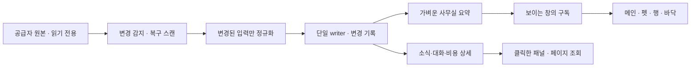

# 상시 실행 경량화 설계

상태: **제안 / 미구현** · 조사: 2026-10-07 KST. 이번 변경은 최신 코드 수신, 읽기 중심 측정, 설계 문서화다. 실행 서버 교체·최적화 적용·데이터 삭제는 하지 않았다.

**구현 현황 ([#45](https://github.com/kys42/agent-office/issues/45))**

- P0-A 구현:
  - workspace 의미 해시: `workspaceSignature`가 `git.observedAt`을 제외한다.
  - 같은 revision은 이번 실행에서 이미 받아들였다면 notice·세션·ledger·FTS 쓰기를 모두 건너뛴다.
  - 수집기를 재시작하면 모든 세션을 한 번씩 다시 받아들인다. 분류 로직이 바뀐 경우의 이관을 위해서다.
- P0-B 구현:
  - `officeView`로 snapshot 1회 조회(좌석·소식·목록)
  - writer 파싱 행 캐시. 다른 연결의 커밋은 `PRAGMA data_version`으로 감지해 무효화한다.
  - personal 일괄 조회
  - 내용이 바뀔 때만 emit(확인 시각만 바뀐 경우는 60초마다)
  - snapshot에 `epoch` 추가, 웹 조건부 폴링(`{unchanged}`)
  - Electron은 화면에 보이는 창에만 전송하고, 창이 다시 보일 때 최신본을 1회 보낸다.
  - 렌더러 시계·폴링은 창 가시성(`office:visibility`)을 따른다.
  - Inspector는 이벤트 내용이 바뀔 때만 상세를 다시 조회한다.
- 변경분 전송(3.3의 2번) 구현:
  - 수집기는 바뀐 동료·소식·필드만 담은 patch(`src/shared/snapshot-patch.ts`, `epoch+base→version`)를 보낸다.
  - Electron main은 최신본을 유지하면서, 시작 version을 가진 창에는 patch를, 나머지 창에는 전체를 보낸다.
  - 렌더러(`useOffice`)는 patch를 적용하거나, version 틈이 있으면 전체를 다시 받는다. 안 바뀐 객체는 그대로 재사용한다.
  - 웹은 가진 version을 보내 `unchanged`, 합성 patch(최근 64개), 전체 중 하나를 받는다.
  - 요약 테이블(3.2 다음 단계)은 범위 밖이다.
- 증분 수집(3.4)은 별도 PR이다.

핵심은 **변경 없는 기록을 다시 처리하지 않고, 필요한 화면에 필요한 요약만 전달하는 것**이다. 캐릭터 수를 줄이거나 실시간 소식을 늦추는 방식을 첫 해결책으로 삼지 않는다. 기존 [골든 정책](../golden/GOLDEN-OFFICE-POLICY.md), [관측 규격](../golden/OFFICE-OBSERVATION-PROTOCOL.md), [수집 계약](SESSION-INGESTION.md)을 유지한다.

## 1. 코드와 측정 기준

| 대상                | 확인한 기준                                        | 의미                                                    |
| ------------------- | -------------------------------------------------- | ------------------------------------------------------- |
| 로컬 주 저장소      | `main` / `0e442ff`                                 | fetch 후 원격 main으로 fast-forward 완료                |
| 추가 UX 코드        | `origin/feat/office-ux` / `ae59dc0`                | 책상 펫·행·공통 office model까지 코드 대조. main과 별도 |
| 열려 있는 후속 작업 | PR #9 terminal jump, PR #11 desk floor (`f37f681`) | 임의 병합하지 않음. 새 표시 모드에도 공통 설계를 적용   |
| 현재 웹 서버        | 별도 `feat/office-ux` checkout / `e0e2c6f`         | 4318 collector, 4319 Vite preview. 기존 프로세스 유지   |

실행 checkout은 `/Volumes/ExternalSSD/Archive/moved-more-20260818-183729/projects/feat/office-ux`다. checkout SHA가 이미 만들어진 프런트 `dist`의 정확한 빌드 SHA까지 증명하지는 않는다. 아래 라이브 수치는 **현재 서버**의 측정이며 최신 main의 배포 성능으로 해석하지 않는다. 주요 반복 처리 경로가 main과 추가 UX 브랜치에도 남아 있는 것은 코드로 확인했다.

### 측정 결과

| 항목                   | 관측 결과                                                           | 한계                                                                                         |
| ---------------------- | ------------------------------------------------------------------- | -------------------------------------------------------------------------------------------- |
| collector CPU          | 30.20초 동안 누적 CPU 2.28초 → 단일 코어 기준 평균 **7.55%**        | 사용 중인 로컬 환경. 통제된 무활동 실험 아님. 자식 Git CPU 제외                              |
| collector RSS          | **241.2~278.2 MiB**, 5초 간격 7회                                   | 브라우저·GPU·Electron 전체 메모리 아님. heap/누수 판정 아님                                  |
| `ps` 순간 CPU          | 표본 중 최대 64.1%                                                  | 지속 사용률이나 전체 시스템 점유율로 해석하지 않음                                           |
| snapshot RPC           | **180.9 / 230.1ms**, 약 **1.98MB (1.89MiB)**                        | 18초 간격 2회. p95 측정 아님                                                                 |
| snapshot 내용          | 세션 280개, 소식 662개; 세션 약 1.47MB, 소식 약 0.51MB              | 관측 중 기록이 계속 변함                                                                     |
| 원본 활동과 revision   | 279개는 `updatedAt` 동일, 그중 **170개 revision 변경**              | 해당 170개의 workspace 차이는 `git.observedAt`뿐. 다른 필드의 모든 원인을 배제한 실험은 아님 |
| main의 read-only store | `list()` 5회 **40.1~69.4ms**, `noticeList()` **41.9~63.3ms**        | 같은 실제 DB, 별도 프로세스. hot-cache 단기 측정                                             |
| 저장 데이터            | 세션 280행 / JSON 약 **9.29MiB**, usage ledger 5,663행              | `sum(length(cast(data as blob)))`. DB 파일 49.69MiB는 메모리 사용량이 아님                   |
| 파일 discovery 1회     | Codex 118개 / 8.5ms, Claude 6개 / 2.4ms, OpenClaw JSONL 2개 / 5.2ms | DB 수집·파싱·Git 조회 제외. 이 규모에서 디렉터리 탐색을 주범으로 단정할 수 없음              |

collector 외에 preview/concurrently/tsx/esbuild 프로세스와 별도 5173 개발 서버도 확인했다. 다른 작업이 사용하는 서버를 종료하지 않았다. 브라우저 renderer/GPU, 장시간 메모리 변화, cold start, Electron 패키지 성능은 아직 측정하지 않았다.

단순 환산하면 1.98MB를 5초마다 받는 창 하나가 분당 약 23.8MB를 처리한다. 이는 관측 크기와 현재 주기로 계산한 **비압축 논리 전송량**이며 실제 분당 트래픽 측정이 아니다. 여러 탭의 폴링과 상세 조회는 추가된다.

## 2. 확인한 비용 발생 경로

### P0 — 의미 없는 변경이 실제 변경처럼 전파됨

[`server/workspaces.ts`](../../server/workspaces.ts)의 Git 캐시는 15초이며 새 관측마다 `observedAt`을 만든다. [`server/service.ts`](../../server/service.ts)는 workspace 전체 JSON을 session revision에 포함한다. branch/commit이 같아도 시각 변경 때문에 [`store.upsert`](../../server/store.ts)의 동일 revision 생략 경로를 통과하지 못한다.

그 뒤 세션 JSON 저장, usage ledger 재확인·재기록·전체 합계 계산, 검색 색인 삭제/추가까지 이어진다. 이것은 위 170개 관측과 연결되는 **확인된 불필요한 무효화 경로**다. 각각의 CPU 비중은 아직 계측하지 않았다.

### P0 — snapshot 생성과 소비가 너무 무거움

- `OfficeService.snapshot()` → `assignSeats()` → `list()`, `noticeList()` → `list()`, 최종 `list()`: 세션 전체 읽기가 최소 3회다.
- `list()`는 전체 events가 들어 있는 JSON을 파싱한 다음 마지막 4개를 남긴다. `decorate()`는 각 세션의 personal과 preferences를 다시 조회한다. snapshot 요청마다 약 9.29MiB의 저장 세션 JSON을 세 번 읽는 구조다. 이는 약 27.9MiB의 직렬화 입력 처리이며 실제 heap 크기는 별도다.
- `noticeList()`는 모든 소식 JSON을 읽은 뒤 JS에서 필터링한다. 읽지 않은 소식이 쌓일수록 전송과 재처리가 커진다.
- collection마다 `emitSnapshot()`이 version을 올린다. 변경이 없는 경우와 연결 확인 시각 변경도 전체 UI 갱신으로 이어진다.
- [`src/lib/api.ts`](../../src/lib/api.ts)는 탭마다 5초 폴링하며 hidden 여부를 확인하지 않는다.
- [`Inspector.tsx`](../../src/components/Inspector.tsx)의 상세 effect는 `session.events` 배열 참조에 의존한다. 전체 snapshot의 새 배열이 오면 같은 내용이어도 detail을 다시 요청할 수 있다.

### P1 — 수집·캐시의 비용이 실행 시간과 기록 규모를 따라 증가할 수 있음

- 매 cycle JSONL 디렉터리 전체 탐색 후 `maxSessions`로 자른다. 세션 개수 제한이 파일 탐색량 제한은 아니다.
- 바뀐 파일은 매번 제한된 head/tail 구간을 재파싱한다. 3MiB 읽기 제한과 metadata 첫 줄 예외는 이미 있으나 append 한 줄만 처리하는 구조는 아니다.
- Codex index/threads, Claude index/sidecar metadata도 반복해서 읽는다. 이름만 바뀌는 경우를 놓치지 않으면서 별도 캐시가 필요하다.
- OpenClaw는 이미 native revision 캐시가 있지만 매 cycle DB를 열고 목록·seq·rewrite watermark를 확인한다. 단순히 seq만 보고 건너뛰면 재작성과 관계 변경을 잃는다.
- `OfficeService.cache`와 `clawCache`는 byte/entry 예산과 eviction이 없다. Git 캐시는 1,500개 제한이 있다. 전자는 **성장 위험**이며 이번 RSS 표본만으로 메모리 누수가 입증된 것은 아니다.

### P2 — 표시 창과 애니메이션 예산

추가 UX 브랜치는 하나의 ServiceBridge를 사용하지만 snapshot을 main/dock 모두에 보내며 hidden을 구분하지 않는다. `useOffice`라는 코드 공유가 창 사이 계산 결과 공유를 뜻하지는 않는다.

현재 Office는 hidden/reduced-motion일 때 주요 애니메이션을 중지하고, Sprite도 motion-paused를 지원한다. 이 기존 처리를 유지하고 라운지·새 펫/행/바닥 모드까지 일관되게 확장한다. sprite는 이미 steps 기반 저프레임 애니메이션이므로 무조건 FPS만 낮추는 것보다 **갱신할 필요가 없는 대상 자체를 쉬게 하는 것**을 검토한다. 실제 paint/GPU 비용은 후속 trace로 확인한다.

사용 한도는 명시적 조회와 1분 캐시를 사용하므로 상시 폴링 병목으로 분류하지 않는다. API 가격 환산 자체보다 불필요하게 환산을 다시 수행하는 경로를 먼저 줄인다.

## 3. 목표 구조

### 3.1 변경의 종류를 분리한다

공급자 adapter가 표준 관측을 만들고, UI는 공급자별 로그나 문자열을 다시 해석하지 않는다.

| 변경 토큰           | 포함하는 것                                                | 바뀌면 수행할 일                  |
| ------------------- | ---------------------------------------------------------- | --------------------------------- |
| `sourceRevision`    | 파일 generation/offset, DB native revision, parser version | 파싱 및 원본 관측 반영            |
| `contentRevision`   | 제목·공개 대화·도구·모델·usage 등 의미 있는 내용           | 실제 달라진 항목만 저장/색인/집계 |
| `workspaceRevision` | root/common-dir/worktree/branch/commit/state, 위치 근거    | 팀·브랜치·상세 위치 갱신          |
| `personalRevision`  | 메모·별명·핀·수동 구역·보관                                | 개인 설정 투영 갱신               |
| `noticeRevision`    | 소식 내용 버전·view/read/dismiss receipt                   | 말풍선/소식 수 갱신               |
| `healthRevision`    | 연결 상태·실패·마지막 확인 시각                            | 상태 표시만 갱신                  |

`observedAt`과 `lastSync`는 최신 확인 정보를 유지하되 content/workspace 의미 해시에는 넣지 않는다. 실제 branch 변경, detached/unborn, 제목만 변경, 작업 위치 근거 변경은 놓치면 안 된다. P0에서는 기존 session revision을 유지하면서 해시 입력만 의미 필드로 제한하고, 스키마 분리는 후속으로 진행해도 된다.

시간 경과에 의한 work→idle, 퇴근, 보관, 말풍선 만료, 집중 연출은 입력 변경 없이도 발생한다. 이를 `nextTransitionAt` 타이머로 별도 처리한다. 앱 복귀 시 현재 시각으로 즉시 재계산하고, 마지막 확인 시각은 저렴한 연결 상태 메시지로 제공한다. “변경 없음” 최적화 때문에 상태가 영원히 멈추지 않게 한다.

### 3.2 쓰기와 읽기를 분리한다

**첫 단계:** snapshot 한 번에 list/prefs/personal을 한 번만 읽고 동일한 결과를 좌석·소식·요약에서 재사용한다. 변경 없는 상태에는 캐시된 snapshot을 사용한다. 좌석 할당은 구성·관계·구역·복귀 변경과 시간 경계에서만 수행한다. 조회 자체가 좌석 쓰기를 유발하는 결합을 해소한다.

**다음 단계:** `session_summary`를 추가해 화면용 DTO를 저장한다. canonical session/대화/usage ledger/receipt는 별도로 남긴다. 단순히 SQL `json_extract`로 매번 모든 대화를 해석하는 방식은 목표가 아니다.

- `OfficeResidentSummary`: canonical ID/actor·관계, 표시 이름, 팀·브랜치·좌석, 상태 근거, 작업 시작 시각, 최신 요청/진행/최종 발췌, 소식 개수, 비용 합계, 표시 revision.
- 발췌는 각 메시지 최대 240자로 제한하고 `eventId`, `noticeId`, `version`, `truncated`를 함께 제공한다. 원문은 저장 계층에서 보존한다.
- `detail(id, cursor, limit=40)`과 `notices(cursor, limit=50, filter)`로 필요할 때 원문을 읽는다. 최신 말풍선 하나와 정확한 미확인 수는 summary에 포함한다.
- 명단에는 모든 동료의 얇은 요약이 남는다. 사무실 밖이라고 세션 자체를 삭제하거나 최근 세션을 임의로 숨기지 않는다. 부모/페르소나 투영에 필요한 필드를 보존한다.
- 소식의 count와 검색/페이지는 SQL 인덱스로 조회한다. `seenAt/dismissedAt/kind/background/version` 등은 조회 가능한 열로 점진 이관한다. 메모리 절약을 이유로 미확인 최종 응답을 버리지 않는다.
- store의 prepared statement와 preferences/personal map을 batch 단위로 재사용한다. `upsert`의 이전 JSON도 한 번만 파싱한다.

usage ledger는 **바뀐 entry만** 갱신하고, entry의 이전/새 기여분 차이로 합계를 수정한다. native response 도입 시 fallback 중복 제거, 스트리밍 보정, 모델/단가 버전 변경은 별도 재집계 경로가 필요하다. 합계 검증을 통과하기 전에는 기존 전체 집계를 정본으로 유지한다. FTS는 실제 검색 본문이 달라질 때만 수정한다.

notice ingestion은 단순히 전체 함수를 생략하지 않는다. 원본 이벤트 revision과 task/status 경계, parser migration, attention 해소를 분리해 새 요청·늦은 최종 응답·읽음 버전 정책을 검증한다. receipt는 원본 재수집으로 덮어쓰지 않는다.

### 3.3 표시 중인 창에 변경만 보낸다

1. P0 호환 RPC: `snapshot(ifVersion)` → 변경 없음이면 `{unchanged:true, version, health}`. 이전 API도 당분간 지원한다. POST RPC에 HTTP 304를 억지로 넣지 않는다.
2. P1 변경 스트림: `epoch + sequence`, changed summaries, removed IDs, notice counters/receipts만 전송한다. boot 또는 연결 복구 시 full summary를 받는다.
3. delta 버퍼는 개수·byte 상한을 둔다. sequence가 끊기거나 epoch가 바뀌면 full summary로 복구한다. 오래된 client의 응답이 최신 상태를 덮어쓰지 못하게 한다.
4. Electron은 기존 IPC, 웹은 기존 Origin/Host/전용 헤더 검증을 보존하는 fetch stream 또는 cursor long-poll을 우선한다. 새 인증 없는 공개 소켓을 열지 않는다. 웹 스트림 구현 전에도 조건부 폴링으로 비용을 줄일 수 있다.
5. hidden 탭은 데이터 구독/상세 조회를 쉬고, 다시 보이면 cursor로 따라잡는다. visible 탭 여러 개는 서버의 동일 요약 캐시를 공유한다. 탭 leader 선출은 측정 후 선택할 후속 최적화다.
6. Electron main이 창의 show/hide/minimize/restore를 알고 구독을 제어한다. `document.hidden`만 의존하지 않는다. `show:false` 창은 초기 visibility가 visible일 수 있다는 [Electron 문서](https://www.electronjs.org/docs/latest/api/browser-window#page-visibility)를 고려한다.
7. Inspector는 `id + detailRevision`으로 재조회하고 events 배열 identity를 의존성으로 쓰지 않는다. 변경 없는 동료 객체 참조는 유지한다.

창이 닫혀도 collector는 소식을 저장한다. **전송·렌더 중단과 수집 중단은 다르다.** 재접속 자체로 viewed/read receipt나 새 작업 도착 효과를 만들지 않는다. 원본 사건 ID와 실제 노출/사용자 행동으로 처리한다.

### 3.4 수집을 변경 중심으로 바꾼다

| 소스                             | 빠른 경로                                                                    | 복구 경로                                                |
| -------------------------------- | ---------------------------------------------------------------------------- | -------------------------------------------------------- |
| Claude/Codex JSONL               | 디렉터리 watcher → 변경 파일 debounce → 마지막 완결 줄 이후 append           | 시작/복귀/overflow/오류 시 bounded 재스캔, 주기적 대조   |
| Codex index·Claude index/sidecar | 본문과 별도 fingerprint/캐시, 변경 시 이름·관계만 반영                       | metadata schema/parser 변경 시 재구축                    |
| Codex/OpenClaw SQLite            | 소수의 유지되는 read-only 연결에서 data_version 확인 후 native metadata 비교 | DB 교체/스키마 변경 시 재연결·baseline 초기화            |
| Git                              | cwd→worktree 매핑, 동일 worktree 조회 결합; HEAD·ref 변경으로 무효화         | 활성 worktree 30~60초, 비활성 5분 대조를 시작값으로 검증 |

watcher는 변경 힌트로만 쓴다. 파일 교체·inode·filename 누락·일부 환경의 감시 제약이 있으므로 복구 스캔을 유지한다. [Node fs.watch 주의사항](https://nodejs.org/api/fs.html#caveats)

파일 cursor는 `(source identity, dev/ino, generation, completeOffset, parserVersion)`을 포함한다. append 여부가 확실할 때만 증분 처리하고, 축소·교체·재작성 감지 시 기존 bounded reader로 복귀한다. 마지막 미완결 UTF-8/JSONL은 다음 append까지 보존하되 byte 상한을 둔다. 같은 크기 덮어쓰기까지 검출하도록 재검증 fingerprint와 주기적 대조를 둔다. offset과 파싱 상태는 저장 성공과 함께 반영해 crash 뒤 이벤트를 놓치지 않는다.

> **구현됨 (#45)**: 폴링은 그대로 두고 JSONL append 증분 읽기(dev/ino·64바이트 guard·축소/교체/10분 대조 시 bounded reader 복귀)와 Codex index·DB/WAL, Claude index·sidecar의 mtime+size 캐시를 넣었다. cursor는 메모리에만 두므로 재시작 뒤에는 전체 경로로 읽어 누락이 없다. watcher·SQLite `data_version`·Git 무효화는 아직이다. 계약은 [세션 수집 문서](SESSION-INGESTION.md#jsonl-증분-읽기-45).

SQLite `PRAGMA data_version`은 **같은 연결에서 관측한 값끼리만** 비교한다. 매번 새 연결에서 읽은 값을 비교하는 캐시는 잘못이다. DB 연결을 유지하더라도 장시간 read transaction은 유지하지 않는다. 연결 수/메모리를 제한하고 DB/WAL 교체를 처리한다. [SQLite data_version](https://www.sqlite.org/pragma.html#pragma_data_version)

OpenClaw의 seq는 계속 증가한다고만 가정하지 않는다. rewrite watermark, status/name/parent/actor 변경은 별도 revision이며 JSONL/SQLite 조각 병합과 페르소나 투영도 기존 계약을 따른다. 상한으로 잘린 목록이나 일부 read 오류를 source 삭제로 오인하지 않는다. cursor만 잘못 진전시켜 누락을 영구화하지 않도록 bounded 복구 경로를 남긴다.

새 watcher부터 전면 도입하기보다 P0의 불필요한 쓰기/조회 제거를 먼저 적용한다. 이번 로컬 discovery는 짧았기 때문에 기대 효과와 리스크 면에서 이 순서가 합리적이다.

### 3.5 메모리와 실행 예산

- 파싱 캐시: entry 수와 추정 byte의 이중 상한. 초기 제안 총 48MiB, 상세 LRU 16MiB. 실제 heap/RSS를 보고 조정하며 숫자를 보장치로 표현하지 않는다. — **구현됨 (#45)**: JSONL 읽기 창 원문 32 MiB LRU, 파싱 캐시 4000개 상한.
- active/selected source를 우선하고 제거된 경로·비활성 공급자 항목을 정리한다. 큰 단일 레코드는 처리 후 장기 캐시에 넣지 않는다. 캐시 축출은 사용자 데이터 삭제가 아니다. — **구현됨 (#45)**: 수집마다 발견되지 않은 경로·꺼진 공급자·읽지 않은 OpenClaw 노드를 정리, 큰 첫 metadata 복구 파일은 창을 캐시하지 않음.
- source queue는 dedupe하고 동시 읽기 2개, Git 조회 2개를 시작값으로 검증한다. 기다리는 동안 변경이 겹치면 최신 dirty 표시를 남겨 다시 읽는다. 동시성을 줄여 지연이 늘면 조정한다.
- archive/lounging 세션의 원문은 SQLite에 남기고 요약만 상주한다. 영구 ledger/receipt의 디스크 보존 정책은 메모리 예산과 분리한다.
- 생산 실행은 `tsx + concurrently + Vite preview` 대신 빌드된 collector와 정적 파일 제공 경로를 검토한다. Electron은 이미 worker 분리가 있으므로 동일 수집기를 다시 추가하지 않는다.
- web/Electron을 함께 켰을 때 writer 중복 실행을 감지하고 기존 collector에 연결하거나 명확히 거절한다. 한 사용자 data directory당 writer 하나를 보장하며 MCP는 기존 read-only 모드를 유지한다.
- SQLite VACUUM, 주기적 강제 GC, 세션 삭제, 캐시 전부 비우기를 자동 처방으로 쓰지 않는다. RSS만으로 누수를 판단하지 않고 post-GC heap·cache bytes·native 메모리를 함께 본다.

### 3.6 사무실의 움직임은 필요한 곳에 집중한다

기본은 자동 모드다. 동료·책상 수, 색상, 소품은 유지하고 현재 화면의 일하는 동료·새 요청·확인 필요를 우선 움직인다. 쉬는 동료는 짧은 간헐 동작을 하고 나머지 시간은 정지 프레임을 사용한다. 장시간 작업의 불타는 연출은 상태 색/소품을 남기고 입자·그림자 반복량을 낮출 수 있다.

| 화면 상태       | 수집                         | 화면 처리                                          |
| --------------- | ---------------------------- | -------------------------------------------------- |
| 사무실 표시     | 변경 즉시 수집, 복구 검사    | 변경 동료만 갱신, 선택/활동 동료 중심 연출         |
| 펫/행/바닥 모드 | 동일 collector               | 해당 모드에 필요한 요약 구독; 숨긴 main 갱신 중지  |
| 모든 화면 숨김  | 새 최종응답/요청 계속 저장   | 캐릭터·레이아웃·상세 조회 중지                     |
| 절전/모션 감소  | 관측 정확성 유지             | 정지 프레임 중심, 사용자 요청 시 즉시 갱신         |
| 화면 복귀       | cursor 복구 + 상태 시각 대조 | 한 번 reconcile, 기록 재생으로 도착 효과 남발 금지 |

현재 모션 감소 처리부터 모든 표시 모드로 통일한다. 화면 밖 책상은 수동 확대/스크롤 상태에서 animation을 중지하되 전체를 한 화면에 맞추는 정책을 해치지 않는다. 명단·긴 대화만 필요 시 가상화한다. 장면을 Canvas/WebGL로 전면 교체하는 것은 renderer 측정으로 이득이 확인된 뒤의 후보다.

## 4. 구현 순서와 검증

| 단계 | 변경 범위                                                                            | 완료 조건                                                                                     |
| ---- | ------------------------------------------------------------------------------------ | --------------------------------------------------------------------------------------------- |
| P0-A | `workspaces/service/store`: 의미 해시, 변경 없는 upsert/notice/FTS/ledger 쓰기 제거  | Git 확인 시각만 3회 바뀌어도 내용 revision·색인·usage write는 0, 실제 branch/name 변경은 반영 |
| P0-B | `store/service/api/Inspector`: snapshot 단일 조회·캐시·조건부 요청, 상세 재조회 조건 | 변경 없는 폴링에서 JSON 전체 재파싱/재전송/상세 재요청 없음; 시간 경계와 설정 변경 정상       |
| P1-A | summary/detail 분리, 소식 페이지·인덱스, 창 구독·delta                               | 재연결·여러 창의 receipt 일치, 창 수 증가가 수집 횟수를 늘리지 않음                           |
| P1-B | incremental readers, metadata/Git 캐시, cache budget                                 | append/rewrite/rotation/이름변경/부분 실패 회귀 통과, 8시간 캐시 성장 상한 확인               |
| P2   | production web runner, 표시 모드별 모션 예산                                         | renderer/GPU trace와 에너지 비교 후 기본값 결정                                               |

P0부터 독립 PR로 나누고 매 단계 같은 fixture·runtime·프로파일로 전후 비교한다. P1 summary는 additive schema migration과 backfill로 도입한다. 원본 세션·ledger·receipt는 검증 전 제거하지 않는다. legacy full-snapshot 경로를 임시 유지하고 새 reader/delta는 기능 플래그로 전환한다. 실패 시 기존 bounded 수집과 full summary로 되돌릴 수 있어야 한다.

### 성능 목표 — 측정 결과가 아닌 제안한 합격 기준

동일 Mac/Node, warm-up 후 고정된 280세션 fixture 기준. active 1개·10개, 900세션 확장 부하도 별도로 기록한다.

| 시나리오                      | 목표                                                                                  |
| ----------------------------- | ------------------------------------------------------------------------------------- |
| 무변경 + 모든 창 hidden, 10분 | collector 평균 CPU 단일 코어 1% 이하, 내용/FTS/usage 쓰기 0                           |
| 무변경 + 메인 표시            | collector 평균 CPU 2% 이하, unchanged 응답 2KiB 이하                                  |
| 메모리                        | warm collector RSS 160MiB 이하를 1차 목표; 미달 시 heap/native 분리 근거 제시         |
| 8시간 재생                    | cache byte 상한 준수, warm 이후 post-GC heap 증가 10% 이하; RSS만으로 판정하지 않음   |
| 시작·복귀 summary             | 280세션 기준 400KiB 이하, 원문은 필요 시 조회                                         |
| 새 요청/진행/최종응답         | 정상 watcher 환경에서 UI 반영 p95 2초 이하; fallback 지연은 별도 표기                 |
| 인터랙션                      | 60/120/280 동료에서 선택·패널 열기 p95 100ms 이하 목표; renderer 긴 작업과 paint 기록 |
| 창 1→3개                      | 원본 스캔/파싱 횟수 동일; hidden 창에는 장면 delta/animation 전달 없음                |

CPU/메모리 목표를 만족시키려고 소식·이벤트를 누락하거나 상태를 실제보다 늦게 표시하면 실패다. unread 원문이 많아도 summary/페이지 응답은 일정한 상한을 가져야 한다.

### 정확성 회귀 목록

- 3종 native ID·transport ID·event ID, 부모/서브/독립 fork, OpenClaw persona 투영을 유지한다.
- Git 관측 시각만 변경 / 실제 HEAD 변경 / worktree 전환 / 제목만 변경을 분리한다.
- 부분 UTF-8, 미완결 줄, oversized metadata, truncate/replace/same-size rewrite, DB watermark·optional schema를 재생한다.
- 새 요청·진행·최종 응답이 겹쳐도 최신 bubble X 이후 이전 bubble이 살아나지 않는다.
- hidden 중 쌓인 미확인 소식은 복귀 뒤 보이며, 재접속만으로 읽음 처리되지 않는다.
- 부모 다음 작업 경계, 늦은 보조 최종 응답, 퇴근/보관/핀/구역 정책은 변경이 없어도 시각에 맞게 적용된다.
- streaming usage correction·fallback→native·restart·모델/가격 수정 뒤 합계가 기준 전체 계산과 같다.
- client reconnect/sequence gap/server restart/schema migration/부분 실패 뒤 삭제·중복·오래된 응답 덮어쓰기가 없다.
- origin/host/IPC sender 검증, 개인정보 모드, 제외 정책이 summary/detail/delta/MCP 모두에서 일치한다.

### 재측정 방법

1. `git rev-parse HEAD`, runtime/실행 모드, DB fixture 크기, 창 수·visibility·활동 부하를 기록한다. 개인 원문은 benchmark artifact에 저장하지 않는다.
2. collector와 자식 Git, renderer/GPU를 별도 집계한다. CPU는 `ps -o time=`의 시작/끝 누적 CPU 초 차이 ÷ 실제 경과 초로 계산한다. RSS는 KiB→MiB로 변환한다.
3. 단계별 elapsed/CPU, source bytes, parsed events, DB writes, FTS writes, Git spawn 수, snapshot bytes, cache entries/bytes, event-loop delay를 개발용 집계 지표로 추가한다. 원문·경로·토큰은 지표 label에 넣지 않는다.
4. 실제 DB를 분석할 때는 read-only 연결로 counts/byte 합계만 조회한다. `OfficeStore(undefined, true)`의 list/noticeList는 쓰기 없이 측정 가능하다. snapshot RPC는 기존 좌석 할당 경로를 실행하므로 순수 읽기 microbenchmark와 구분한다.
5. 무변경 10분, 1·10 active 세션 재생, 표시/hidden/미니 창, 여러 탭, 8시간 soak를 비교한다. 현재 30초 표본은 이 실험의 대체물이 아니다.

이번 문서 조사에서는 runtime profiling hook, 원본 로그 변경, heap 강제 수집, 앱 재시작을 하지 않았다. 코드 기반 원인과 라이브 단기 측정을 구분해서 기록했으며 절감률은 구현 후 측정한다.

## 5. 후속 작업의 경계

이번에는 문서만 추가한다. 구현 시작 시 이 문서를 기준으로 P0-A/B를 먼저 적용하고, 실제 성능 개선과 회귀 검증 뒤 [아키텍처](ARCHITECTURE.md)·[수집 문서](SESSION-INGESTION.md)·골든 정책의 현재 계약을 함께 갱신한다. 특히 현재 정책의 15초 Git 캐시와 원본/현재 위치 구분을 조용히 바꾸지 않는다.

새 외부 모듈을 이번 조사에서 편입하지 않았다. 기존 Orca bounded JSONL reader와 자체 정규화 계층은 재사용하고, 증분 cursor가 원본 reader의 완결 줄·레코드 한도 계약을 보존하도록 확장한다. 출처와 라이선스 기준은 [레퍼런스 감사](../research/INGESTION-REFERENCE-AUDIT.md)를 따른다.

작업 기록·진행 범위의 정본은 [기존 Agent Office 카드](https://app.notion.com/p/3ee9c0323a9e8145929fd522397579e3)다. 성능 구현 완료나 기존 서비스가 최신 main으로 배포됐다고 표시하지 않는다.
